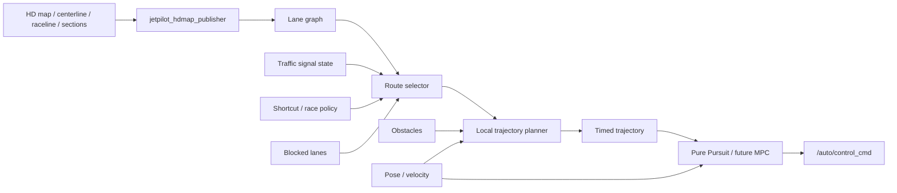

# Planning / Control architecture

この文書は今後実装する planning と control の契約です。現時点の
`autonomous_control_node` は動作確認用の固定値 publisher であり、ここに記載した
自律走行機能はまだ実装済みではありません。

## Package boundaries

新規 package は `jetpilot_` prefix、`ament_cmake_auto`、C++ を基本とします。

| package | responsibility |
| --- | --- |
| `jetpilot_msgs` | lane graph、trajectory、planning/controller status の共通 interface |
| `jetpilot_hdmap_publisher` | HD map の静的情報を読み、可視化と共有用 map data を publish |
| `jetpilot_planning` | centerline/raceline/section を使った route 選択、lane 分岐、局所軌道生成 |
| `jetpilot_control` | 選択済み trajectory を追従し `/auto/control_cmd` を生成 |

ファイル形式の解釈を複数 node にコピーしません。HD map の正規化処理は共有 library
または一つの loader に集約し、planning node は型付き message を受け取ります。
`nav_msgs/Path` は RViz 表示には使えますが、目標速度、lane ID、曲率、停止条件を
保持できないため、controller の正式入力には専用 trajectory message を使います。

## Data flow



route selector は「どの lane を通るか」、local planner は「選んだ corridor 内を
どう避けるか」、controller は「与えられた軌道をどう追従するか」だけを担当します。
この分離により Pure Pursuit と MPC を差し替えても、lane 分岐の判断は変わりません。

## Lane graph and branching

lane は少なくとも次の静的情報を持ちます。

- 一意な lane ID、centerline、任意の raceline、左右境界
- section ID、速度上限、走行方向
- predecessor / successor connection
- connection の種別（default、shortcut、pit、signal-controlled など）
- 分岐を許可する条件 ID と静的 cost

信号色、障害物、shortcut 使用許可は map に現在値として保存せず、runtime state として
route selector に入力します。選択優先度は、走行不能・安全制約、信号などの必須条件、
route policy、通常 lane cost の順にします。候補がなくなった場合は無理に default lane
へ進まず、停止理由を status として publish します。

障害物回避は二段階に分けます。

1. lane 全体が塞がれた場合は route selector が別 successor を選ぶ。
2. 同じ lane corridor 内で回避できる場合は local planner が短い局所軌道を作る。

分岐直前に route が頻繁に切り替わらないよう、決定地点、hysteresis、最低保持時間を
connection ごとに持たせます。

## Message contract

最初に `jetpilot_msgs` へ次の型を追加する想定です。詳細 field は実装前に ID、時刻、
frame の契約を確定します。

- `LaneGraph`, `LaneSegment`, `LaneConnection`
- `Trajectory`, `TrajectoryPoint`（pose、速度、曲率、加速度、lane/section ID）
- `PlanningStatus`（active route、blocked reason、trajectory age）
- `ControllerStatus`（algorithm、tracking error、command age、ready/fault）

静的 map は transient-local、trajectory と状態量は期限付きの volatile QoS とします。
controller は古い trajectory、frame 不一致、localization 不良、NaN/Inf を検出したら
有効な走行指令を出しません。

## Controller sequence

最初の controller は Pure Pursuit とします。設定対象は wheelbase、最小/最大 lookahead、
速度に対する lookahead gain、最大 steering、trajectory timeout です。速度指令は
trajectory point の目標速度を使用し、横偏差が大きい場合は減速します。

同じ入力・出力契約で MPC を後から追加します。controller 選択は launch parameter で
行い、実行中の無条件 hot swap は行いません。既存の固定値
`autonomous_control_node` は Pure Pursuit 実装と安全 watchdog が入った時点で置換します。

## Raceline and vehicle footprint

raceline 最適化では点ではなく車体 footprint を扱います。

```text
effective optimization width = vehicle width + 2 * safety margin per side
```

`vehicle_width_m` は車体の最大幅、`safety_margin_m` は左右それぞれに追加する境界余裕です。
track の有効幅がこれ以下なら境界を自動的に広げず、入力 map の不整合として生成を停止
します。生成物には使用した車幅と margin を metadata として残し、別車両向けの
raceline を誤用しないようにします。実走行時の localization 誤差や制御追従誤差は、
必要に応じて offline margin に加えて local planner の corridor 制約でも扱います。

## Implementation order

1. message 契約、lane graph schema、記録/replay可能な fixture を確定する。
2. `jetpilot_planning` の loader と単一路線 trajectory、`jetpilot_control` の Pure Pursuit、
   timeout 時の停止を実装する。
3. successor graph と shortcut / signal 条件を追加し、分岐 unit test を作る。
4. obstacle input と local avoidance、走行不能時の停止を追加する。
5. 同一 trajectory fixture で Pure Pursuit と MPC を比較できる形で MPC を追加する。

各段階で、狭い lane、分岐条件欠落、全候補閉鎖、古い localization、古い trajectory、
逆向き経路、loop course を自動テストします。Linux Docker 上では `colcon test` に加え、
vehicle interface を無効にした rosbag replay の integration test を実行します。

