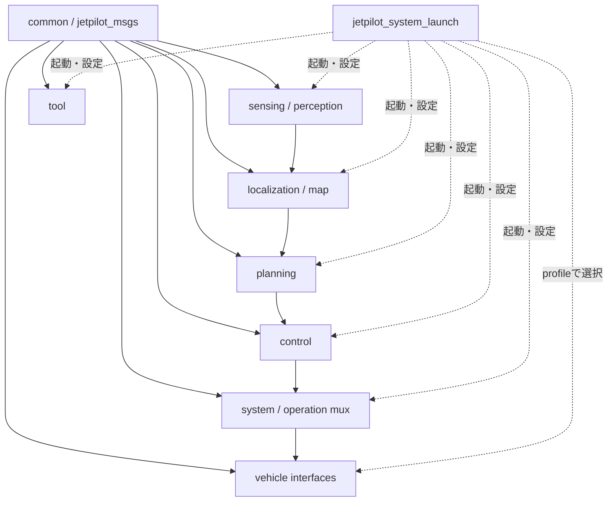

# JetPilotプロジェクト設計方針

この文書は、JetPilotでpackage、node、launch、interfaceを追加・変更するときの
プロジェクト共通ルールを定める。個別機能の詳細設計より上位にある判断基準として扱い、
新規実装とreviewではこの方針を優先する。

既存packageにこの方針へ未移行の箇所があっても、それを新規実装の雛形にしてはいけない。
既存箇所は、関連する機能変更を行う際に段階的に移行する。外部repositoryから取り込む
third-party packageとvendor packageには、JetPilot固有のbuild規約を強制しない。

## 基本原則

JetPilotでは次の原則を守る。

1. hardware非依存の契約を先に定義し、hardware固有処理はadapterへ閉じ込める。
2. packageの責務を小さく保ち、上位機能から下位driverの詳細を参照しない。
3. ROS 2 packageはC++を優先し、Pythonを使う場合もCMakeベースで統一する。
4. 起動構成とhardware選択を分離し、vehicle interfaceやsensor kitをpreset名へ埋め込まない。
5. 実機出力、安全状態、rosbag replayは安全側を既定値にする。
6. topic、message、frame、QoSをpackage間の明示的な契約として扱う。
7. parameter、launch、profile、テスト、READMEを実装と同じ変更単位で保守する。

## Workspaceとpackageの配置

JetPilot管理のROS 2 packageは、責務別に`ros2_ws/src/`以下へ配置する。

```text
ros2_ws/src/
├── common/        共通messageと共通library
├── control/       trajectory追従と車両非依存control
├── launch/        system全体の統合launch
├── localization/ localization managerと位置推定統合
├── map/           map読込みとmap情報publish
├── perception/    認識と推論
├── planning/      route・lane選択とtrajectory生成
├── sensing/       sensor driverとsensor adapter
├── system/        mode管理、mux、system state
├── tool/          calibration、recording、可視化、運用tool
└── vehicle/       vehicle driverとvehicle adapter
```

JetPilotが新しく管理するpackage名には、原則として`jetpilot_` prefixを付ける。
hardware vendorが提供するpackage名や、既存外部packageの名前は変更しなくてよい。

一つのpackageに複数の独立した責務を集約しない。例えば、map fileの解釈、route選択、
controller、vehicle出力はそれぞれ別の責務として扱う。

## 依存方向

共通messageと型を依存関係の下層に置き、統合launchを最上位に置く。



依存方向のルールは次のとおり。

- `jetpilot_msgs`は特定のdriver、launch、algorithm packageへ依存しない。
- planningとcontrolはvehicle driverの型やparameterへ依存しない。
- vehicle interfaceは共通の`ControlCommand`をhardware固有指令へ変換する。
- sensor、vehicle、toolなどの機能packageは`jetpilot_system_launch`へ依存しない。
- `jetpilot_system_launch`はnodeの実装責務を持たず、起動、接続、共通設定を担当する。
- file formatの解釈を複数nodeへコピーせず、一つのloaderまたは共有libraryへ集約する。

## ROS 2 packageの言語方針

### C++を優先する

JetPilot管理の新規ROS 2 nodeは、原則としてC++で実装する。特に次の処理はC++を
優先する。

- 高周期のcontrol、planning、localization処理
- image、point cloud、eventなど大きなmessageを扱う処理
- callback遅延とmemory allocationを予測可能にしたい処理
- composable nodeまたはzero-copyに近い構成が必要な処理
- 実機の安全性やtimeoutに直接関係する処理

Pythonは、低周期の管理処理、file変換、運用tool、試作、外部Python libraryとの統合など、
Pythonを使う利点が明確な場合に選択する。実装の容易さだけを理由に、高rateのdata pathへ
Python nodeを追加しない。

### Build typeは`ament_cmake`

JetPilot管理の新規packageは、C++かPythonかにかかわらず、原則として次を使用する。

```xml
<export>
  <build_type>ament_cmake</build_type>
</export>
```

新規packageで`ament_python`だけのpackage構成を採用しない。Python packageにも
`CMakeLists.txt`を置き、CMakeからmodule、node、launch、configをinstallする。

## C++ packageのCMake規約

C++ packageでは`ament_cmake_auto`を使用する。

### Headerとsourceを分離する

新規C++ packageでは、原則としてclass、struct、共有関数の宣言を
`include/<package-name>/*.hpp`へ置き、実装を`src/*.cpp`へ置く。node classも同じ規則で
宣言と実装を分離し、process entry pointだけを小さな`*_main.cpp`へ置く。

標準構成:

```text
jetpilot_example/
├── include/
│   └── jetpilot_example/
│       ├── example.hpp
│       └── example_node.hpp
├── src/
│   ├── example.cpp
│   ├── example_node.cpp
│   └── example_node_main.cpp
└── test/
    └── test_example.cpp
```

役割は次のように分ける。

| File | 役割 |
|---|---|
| `include/<package>/example.hpp` | algorithm、data型、共有classの宣言 |
| `src/example.cpp` | algorithmと共有classの実装 |
| `include/<package>/example_node.hpp` | ROS node classの宣言 |
| `src/example_node.cpp` | parameter、publisher、subscriber、callbackの実装 |
| `src/example_node_main.cpp` | `rclcpp::init`、node生成、spin、shutdownのみ |
| `test/test_example.cpp` | headerからcore APIを使用するunit test |

追加ルール:

- headerの拡張子は原則`.hpp`とし、新規JetPilot codeでは`.h`と混在させない。
- includeは`#include "jetpilot_example/example.hpp"`のようにpackage名から記述する。
- headerへ大きな実装を直接書くheader-only構成は、templateなど理由がある場合に限定する。
- translation unit内だけで使う小さなhelperは、`.cpp`内のanonymous namespaceに置いてよい。
- 一つの`.cpp`で完結する自明なentry pointは許容するが、node class、状態、callback、
  algorithm、変換処理が増えた場合は`.hpp`と`.cpp`へ分離する。
- test対象または複数translation unitで共有する処理を、nodeの単一`.cpp`へ閉じ込めない。
- node固有処理とROS非依存のcore処理を分け、coreをlibraryとしてunit testできるようにする。
- `include/<package>/`以下の公開headerには、必要最小限のincludeだけを置き、
  `using namespace`を記述しない。

既存の単一`*_node.cpp`構成を一度に全面変更する必要はない。ただし、該当nodeへ大きな
機能追加やtest追加を行う場合は、同じ変更でheader/source分離を検討する。新規packageは
既存の単一cpp構成を雛形にせず、`jetpilot_controller`や`jetpilot_planning`のcore構成を
参考にする。

### CMakeの標準形

`package.xml`には少なくとも次を記載する。

```xml
<buildtool_depend>ament_cmake_auto</buildtool_depend>
```

標準的な`CMakeLists.txt`は次の形にする。

```cmake
cmake_minimum_required(VERSION 3.8)
project(jetpilot_example)

if(CMAKE_COMPILER_IS_GNUCXX OR CMAKE_CXX_COMPILER_ID MATCHES "Clang")
  add_compile_options(-Wall -Wextra -Wpedantic)
endif()

find_package(ament_cmake_auto REQUIRED)
ament_auto_find_build_dependencies()

ament_auto_add_library(${PROJECT_NAME}_core SHARED
  src/example.cpp
)
target_compile_features(${PROJECT_NAME}_core PUBLIC cxx_std_17)

ament_auto_add_library(${PROJECT_NAME}_node SHARED
  src/example_node.cpp
)
target_compile_features(${PROJECT_NAME}_node PUBLIC cxx_std_17)
target_link_libraries(${PROJECT_NAME}_node ${PROJECT_NAME}_core)

ament_auto_add_executable(example_node
  src/example_node_main.cpp
)
target_compile_features(example_node PUBLIC cxx_std_17)
target_link_libraries(example_node ${PROJECT_NAME}_node)

install(DIRECTORY config launch
  DESTINATION share/${PROJECT_NAME}
)

if(BUILD_TESTING)
  find_package(ament_cmake_gtest REQUIRED)
  ament_add_gtest(test_example test/test_example.cpp)
  target_link_libraries(test_example ${PROJECT_NAME}_core)
endif()

ament_auto_package(USE_SCOPED_HEADER_INSTALL_DIR)
```

追加ルール:

- 依存packageは原則として`package.xml`へ記載し、`ament_auto_find_build_dependencies()`で
  解決する。
- `ament_auto_package(USE_SCOPED_HEADER_INSTALL_DIR)`を使用し、公開headerを
  `include/<package-name>/`単位でinstallする。
- header、source、nodeのmainを分離し、algorithmとnode実装をlibraryとしてテスト可能に
  する。
- 新規C++ codeは原則C++17を基準とする。依存先がより新しい規格を必要とする場合は、
  package単位で明示する。
- compile warningを無効化して問題を隠さない。
- launch、config、READMEなどruntimeに必要なfileをshare directoryへinstallする。

## Python packageのCMake規約

Pythonでnodeを実装する場合も`ament_cmake_auto`と`ament_cmake_python`を併用する。

`package.xml`には少なくとも次を記載する。

```xml
<buildtool_depend>ament_cmake_auto</buildtool_depend>
<buildtool_depend>ament_cmake_python</buildtool_depend>
```

標準的な`CMakeLists.txt`は次の形にする。

```cmake
cmake_minimum_required(VERSION 3.8)
project(jetpilot_example_tools)

find_package(ament_cmake_auto REQUIRED)
find_package(ament_cmake_python REQUIRED)

ament_auto_find_build_dependencies()

ament_python_install_package(${PROJECT_NAME})

install(PROGRAMS
  ${PROJECT_NAME}/example_node.py
  DESTINATION lib/${PROJECT_NAME}
)

install(DIRECTORY config launch
  DESTINATION share/${PROJECT_NAME}
)

ament_auto_package()
```

Python packageの追加ルール:

- import可能なmoduleは`ament_python_install_package(${PROJECT_NAME})`でinstallする。
- ROS nodeとして実行するscriptは`install(PROGRAMS ... DESTINATION lib/${PROJECT_NAME})`
  でinstallする。
- dependencyは`package.xml`へ記載し、CMake側へ重複した依存一覧を持たない。
- `launch/`と`config/`をsource treeだけに置かず、share directoryへinstallする。
- Pythonを選択した理由がなくなり、高rate data pathのbottleneckになった場合はC++へ
  移行する。

既存のPython packageに`ament_cmake_python`だけを使用するものがあっても、それを新規
packageの雛形にしない。関連変更時に`ament_cmake_auto`併用へ移行する。

## Messageとtopicの契約

package間ではdriver固有messageよりJetPilot共通messageを優先する。共通messageは
`jetpilot_msgs`へ置き、hardware固有型との変換はinterface package内で行う。

制御指令の標準flowは次のとおり。

```text
/auto/control_cmd
/teleop/control_cmd
/propo/control_cmd
        ↓
jetpilot_operation command mux
        ↓
/vehicle/control_cmd
        ↓
vehicle interface
        ↓
hardware固有command
```

`ControlCommand`は正規化されたsteering、throttle、brake、reverseを表す。上位nodeが
PWM、eRPM、CAN ID、serial protocolなどを扱ってはいけない。

QoSはdataの意味に合わせる。

- 高rateのcontrol commandは`KeepLast(1)`、best effortとし、古い指令をqueueしない。
- modeや状態はreliableを基本とする。
- 現在状態をlate joinerへ渡す必要があるtopicはtransient localを使用する。
- QoSをpackageごとに独自決定せず、publisherとsubscriberの契約として揃える。

詳細は[Control QoS Notes](control_qos.md)と
[`jetpilot_msgs` README](../ros2_ws/src/common/jetpilot_msgs/README.md)を参照する。

## Launchと設定の方針

`jetpilot_system_launch`は、system全体の起動入口として次を担当する。

- packageとnodeの起動順・有効化
- 共通topic、frame、parameterの接続
- localization、planning、control、toolの組合せ
- live実機構成とoffline replay構成の安全条件
- vehicle interfaceとsensor kitのprofile選択

各機能のalgorithm、driver実装、hardware固有parameterはsystem launchへ置かない。

launch実装ではIsaac ROSの`isaac_ros_launch_utils`を使用し、opaque function内外の
型評価ルールを守る。詳細は
[Isaac ROS Launch Guidelines](isaac_ros_launch_guidelines.md)を参照する。

## Presetとhardware profile

bringup presetは「どの機能群を起動するか」を表し、hardware profileは「どの実装を
使用するか」を表す。

```text
preset:
  vehicle / teleop / drive / runtime / localization / replay ...

profile:
  vehicle interface
  sensor kit
```

新しいhardwareの追加時に`drive-<hardware>`や`runtime-<hardware>`のようなpresetを
増やさない。共通presetと動的profileを組み合わせる。

```bash
./scripts/bringup.sh drive \
  --vehicle <vehicle-profile> \
  --sensor-kit <sensor-kit-profile>
```

profile ID、manifest、共通launch契約の詳細は
[Bringup profile追加ルール](bringup_profile_rules.md)を参照する。

## Hardware依存の分離

vehicle、camera、IMU、LiDARなどのhardware固有処理は、個別のinterface packageまたは
sensor kit packageへ置く。

- driver固有topicをJetPilot標準topicへremapまたは変換する。
- device path、serial port、PWM range、CAN設定などは個別packageのparameterへ置く。
- hardware固有URDF、mount、descriptionは個別packageへ置く。
- system launchはpackage、launch、profileの選択だけを知る。
- localization、planning、controlはhardware packageへ依存しない。

詳細は[Hardware Interface Package Design](hardware_interface_packages.md)を参照する。

## 安全設計

実機へ指令を出す機能は、安全側を既定値にする。

- operation modeの初期値は`STOP`とする。
- command muxは有効で新しい入力だけを採用し、それ以外は停止指令を出す。
- muxとvehicle driverの両方に独立したtimeoutを持たせる。
- bringup presetはactuator moduleを明示的に有効化するまで起動しない。
- 実機hardwareを起動する前に、選択内容を表示して確認する。
- rosbag replayとvehicle interfaceを通常構成で同時に有効化しない。
- replayされた制御、mode、actuator topicをlive graphから隔離する。
- HIL試験は専用ROS domainと物理的安全措置を用意し、unsafe設定を明示する。

安全guardを利便性のために既定で解除してはいけない。詳細は
[rosbag Replay Safety](rosbag_replay_safety.md)を参照する。

## Parameterとfile format

- 調整可能な値をsource codeへhard codeせず、ROS parameterまたはprofileへ置く。
- hardware固有parameterを共通system launchのconfigへ漏らさない。
- runtimeの既定値とTUI／profileの既定値を矛盾させない。
- map、raceline、model metadataなどのfile formatはschemaと責務を文書化する。
- 同じfile format parserを複数nodeへコピーしない。
- pathはhostとDocker workspaceのどちらのpathかをREADMEで明示する。

## テスト方針

変更のriskに応じて、最低限次を確認する。

- C++ algorithmはnodeから分離し、unit testを追加する。
- Pythonの純粋な変換・検証処理はROS graphなしでテストできるようにする。
- launch引数、profile、parameterはdry-runまたはlaunch testで検証する。
- package追加時は単体buildと対象testを実行する。
- replay safety、vehicle選択、topic remapなど安全に関わる条件には回帰testを置く。
- 実機testが必要な変更は、実行条件、device、期待結果をREADMEへ記録する。

テストのためだけにhardware接続やunsafe flagを暗黙に有効化してはいけない。

## Documentation方針

新規packageにはREADMEを置き、少なくとも次を記載する。

- packageの責務と責務外
- node、input/output topic、message型、QoS
- parameterと既定値
- frameと座標系
- launch方法
- hardware、model、mapなど外部依存
- 安全上の注意
- build方法とtest方法

共通契約を変更した場合は、実装packageのREADMEだけでなく、対応する`docs/`の設計文書も
同時に更新する。

## 新規ROS 2 packageのチェックリスト

- packageの責務が既存packageと重複していない
- JetPilot管理packageでは`jetpilot_` prefixを検討した
- C++で実装できるかを先に検討した
- build typeが`ament_cmake`になっている
- C++では`ament_cmake_auto`を使用している
- C++の共有宣言を`include/<package>/*.hpp`、実装を`src/*.cpp`へ分離している
- node classの実装とprocess entry pointを分離している
- Pythonでは`ament_cmake_auto`と`ament_cmake_python`を併用している
- dependencyを`package.xml`へ記載した
- launch、config、READMEをinstallしている
- 共通message、topic、frame、QoS契約に従っている
- hardware固有処理が上位packageへ漏れていない
- unit testまたはlaunch testを追加した
- system bringupへ追加する場合も安全側を既定値にした
- READMEと関連する設計文書を更新した

## 関連設計文書

- [Hardware Interface Package Design](hardware_interface_packages.md)
- [Bringup profile追加ルール](bringup_profile_rules.md)
- [Bringup presets / TUI](bringup_launcher.md)
- [Planning / Control Architecture](planning_control_architecture.md)
- [Isaac ROS Launch Guidelines](isaac_ros_launch_guidelines.md)
- [Control QoS Notes](control_qos.md)
- [rosbag Replay Safety](rosbag_replay_safety.md)
- [`jetpilot_system_launch` README](../ros2_ws/src/launch/jetpilot_system_launch/README.md)
- [`jetpilot_msgs` README](../ros2_ws/src/common/jetpilot_msgs/README.md)
