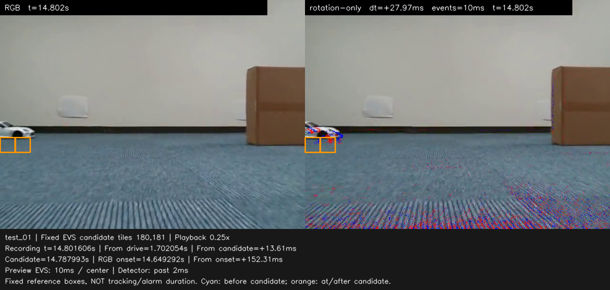
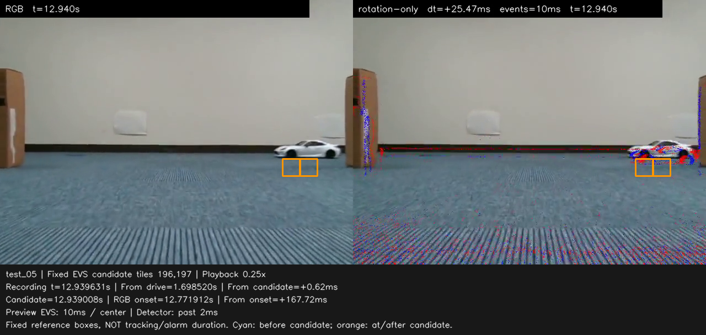
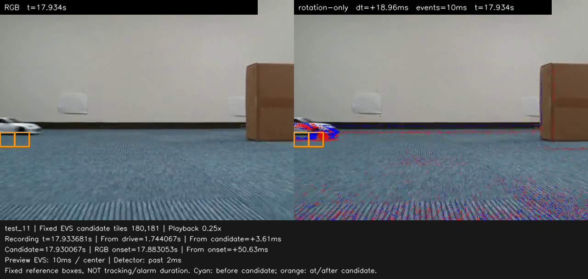
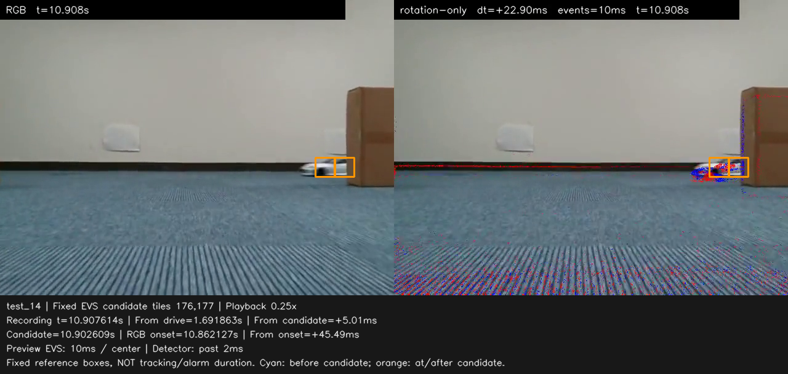

# 移動自車・EVS候補4件の画像照合（2026-10-06）

## 結論

調整用4件のcontact sheetと候補直後の原寸画像では、車両の輪郭に沿う局所イベントが候補タイルと重なる。
「車両出現に伴う反応」という解釈を支持する定性的な根拠が得られた。
一方、背景イベントも残り、RGB車体とEVS輪郭には位置ずれがある。
判定に用いた過去2 ms窓そのものを確認したわけではないため、背景の寄与を除外した検知成功とは確定しない。

対象は[直接解析](rc_popout_development_bundle_analysis_20261006.md)のEVS閾値0.25の4候補。
追加診断の「横ペアのみ・閾値0.10」の結果とは区別する。
今回、検知設定・候補時刻・同期・注釈・ROIは変更していない。

## 確認資料と整合

ユーザーから受領したスクリーンショット2枚、4件のcontact sheet、および同じ転送先にある候補直後のPNGを確認した。
各記録の `summary.json` と `frames.csv` も読み、次を確認した。

- 候補時刻・ペア座標・同期／注釈ハッシュが、解析時の `candidate_review_manifest.json` と4件とも一致。
- 各36行のフレーム時刻、候補との差、RGB初出現との差が整合。
- 候補以降の最初の表示フレームがJSONとCSVで一致。
- 受領PNGを復号でき、単独画像1280×608、contact sheet 2560×1280。

受領ファイルのSHA-256、確認範囲と数値を
[review_provenance.json](evidence/rc_popout_20260930/candidate_visual_review_20261006/review_provenance.json)に保存した。
この整合検査は保存物同士の確認であり、現在のLinux側のRAWや同期YAMLを読み直したものではない。
元録画全体の動画レビュー、判定窓のRAW再抽出、評価用記録の実行は行っていない。

## 記録ごとの観察

| 記録 | 条件 | 候補−RGB初出現 | 画像で観察できること |
|---|---|---:|---|
| `test_01` | 20%・左 | +138.7 ms | 左端の車両輪郭に沿うイベントの下部が2タイルへ入る。RGB車体は主に枠より上で、枠の多くは床に重なる。 |
| `test_05` | 20%・右 | +167.1 ms | 右の遮蔽物から出た車両の下部に沿うイベントが枠の上部へ入る。RGB車体は主に枠より上。 |
| `test_11` | 100%・左 | +47.0 ms | 左端の車両に沿うイベントが枠へ入る。RGBより下側へのずれと、近傍の壁・床境界イベントも見える。 |
| `test_14` | 100%・右 | +40.5 ms | 車体と車両に沿うイベントの枠への重なりが4件中では明瞭。近傍に段ボール端と壁・床境界のイベントもある。 |

20%・100%はプロポ設定であり、測定した速度ではない。
時刻差はJSON中の候補時刻からRGB手動初出現注釈を引いた値。
候補以降の最初の表示フレームは、候補より順に13.613、0.623、3.614、5.006 ms後なので、
画像中の `From onset` は表の値よりその分だけ大きい。

### test_01

### test_05

### test_11

### test_14

## 位置と時刻の解釈

**枠はEVS候補の2タイルであり、RGB検知結果や車体の外接矩形ではない。**
両パネルに同じEVS座標を描いている。車体を囲み直したり、対象を追跡したりしていない。
従って、RGBパネルの枠内が主に床でも、それだけでEVSの床への誤反応とは判定できない。
右パネルでは車両の輪郭に沿うイベントが実際に枠内へ入っている。

RGBとEVSの上下方向の位置ずれは観察できるが、その原因をこの画像だけで同期ミスと決めない。
現在の投影は `rotation-only` で、実装の `_projection_homography` は回転のみを使い、カメラ間の並進を使わない。
描画コードも残る視差を制約として明記している。
視差や校正残差は原因候補だが、今回それぞれの寄与は測定していない。
この画像から時間offsetを調整したり、全体を一定量ずらす補正を確定したりはしない。

また、左側の `test_01 / test_11` では、確認区間に左の遮蔽物が映っておらず、車両は画像左端から入る。
この共通視野上での初出現を、遮蔽物の端から物理的に見え始めた瞬間と同一とは扱わない。
RGB初出現の定義と共通視野の境界を、結果の説明にも残す。

プレビューは中心10 ms窓で、フレーム時刻より後のイベントも含む。
検知器の入力は過去2 ms窓であり、さらに過去のスコアを積分して判定する。
候補直前から輪郭が見えていても矛盾ではなく、表示フレームから正確な判定窓の寄与は再構成できない。
表の40～167 msはこの判定条件を満たすまでを含む候補遅れで、EVS素子固有の応答遅延ではない。
RGB検知器・人間との時間差、オンライン処理時間、ブレーキ作動時間も表していない。

## 次に進める作業

今回のEVS結果を、定性的な対応を確認した調整用の比較基準として保存する。
次の手法開発は同じ調整用5記録で、RGB/EVSに共通する「背景の移動で説明できない局所変化」の抽出へ進める。
現行RGBの未検知・早期候補が解消したかも併せて検証する。
今回の4枚に合うようにROIを寄せたり、出現時刻で検知を開始したりしない。

厳密な候補の寄与を調べる場合は、同じ時刻の過去2 msイベント画像と、その前後のタイルスコアを対応させる。
同期と画像の全生成をやり直す根拠は、今回の確認からは得られていない。
手法・設定を固定してから内部評価用10件、続いて静止記録へ進む。
