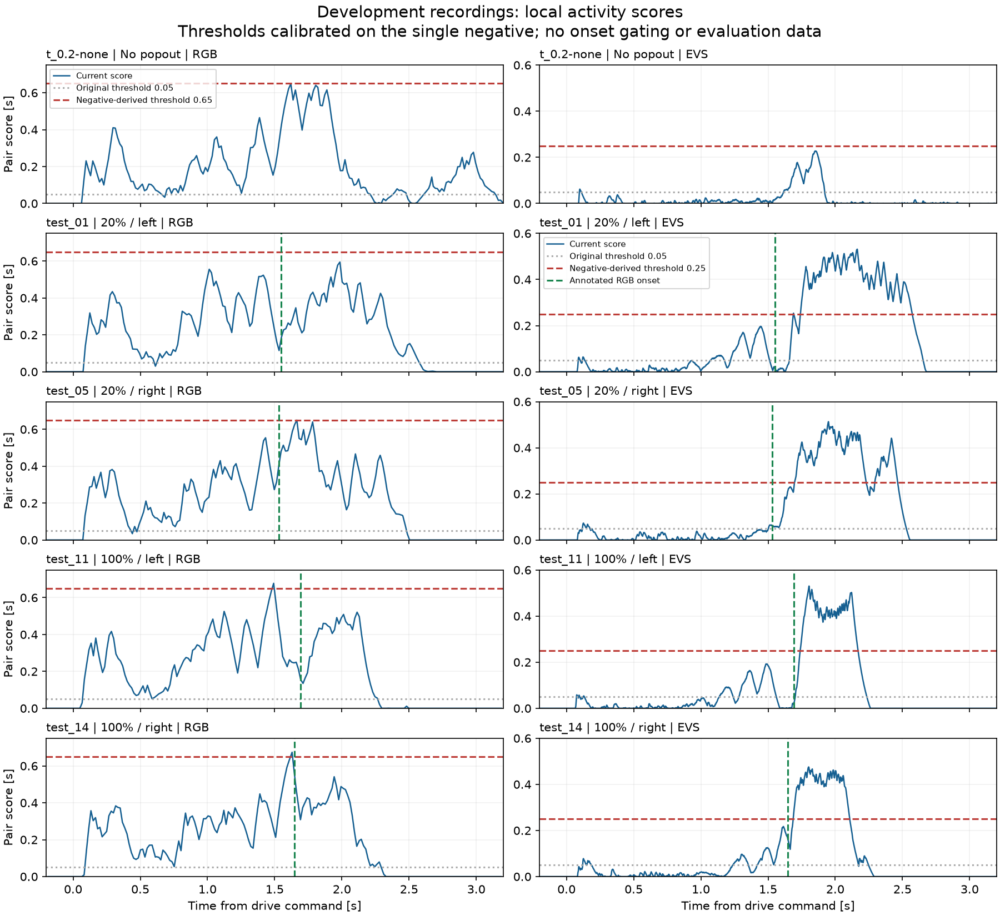

# 移動自車・調整用タイル時系列の直接解析（2026-10-06）

## 結論

受領した調整用5記録で、EVSの現行局所スコアには背景と出現後の反応を分ける余地がある。
元の開始閾値0.05を、負例1記録から決めた0.25へ変更すると、負例の候補は0件、正例は各1件となった。
4件ともRGB初出現より後であり、遅れは138.7、167.1、47.0、40.5 ms。
これは調整用データに対する候補抽出結果で、対象への反応の映像確認・評価用データでの確認はまだ行っていない。

RGBは同じ選定手順で閾値0.65になるが、20%の2件では候補なし、100%の2件では初出現より前に反応する。
今回試した標準化下限・空間条件・活動量の平滑化でも、背景を全て抑えつつ4件全てを初出現後250 ms以内に拾える振幅閾値はなかった。
全てのパラメータや検知方式が不可能という結論ではない。現行の活動量スコアだけを微調整し続けるより、背景の動きを説明する特徴を加える方針を推奨する。

## 入力と再現確認

- 入力：ユーザー提供の `development_debug_bundle01.zip`（32ファイル、約0.9 MiB）。
- 記録：`t_0.2-none`, `test_01`, `test_05`, `test_11`, `test_14`。固定済みの調整用のみ。
- ROI：EVS座標の `(x=0, y=70, width=640, height=272)`、有効174,080画素、32 pxグリッド180タイル。
- RGBは変化画素数／有効画素数、EVSは2 ms窓のイベント数／有効画素数、EVS更新間隔1 ms。
- アーカイブのファイル名・split・コードハッシュ・設定の整合を検査した。NPZ 10件とタイルメタデータ／結果10件は、局所検知結果に保存されたSHA-256と一致。
- 元の検知器を再実行し、全10ケースで保存時の候補数・開始終了時刻・開始時のペアIDが一致した。時刻の許容誤差は1 ns。
- 受領した保存結果の整合確認であり、現在のRAW・同期YAML・注釈を読み直して確認したものではない。
- 評価用10記録と静止記録は読み込んでいない。split固定前に全体集計を見ているため、今後の評価も完全な未見データではなく内部評価となる。

入力ハッシュと解析コードのハッシュは[provenance.json](evidence/rc_popout_20260930/development_bundle_analysis_20261006/provenance.json)に保存した。

## 現行スコアの時間変化

青が元のスコア、灰色が元の開始閾値0.05、赤が負例から決めた閾値、緑がRGB初出現。
図は発進指令−0.2～3.2秒の拡大表示。判定・閾値選定は保存された全時間を使い、図の範囲や発進時刻で検知を制限していない。
両センサの縦軸の上限は異なる。



背景だけでもRGBの高いスコアが続く。一方、EVSは出現前にも背景ピークがあるものの、出現後にそれを上回る反応がある。
活動の発生位置や実際の対象との重なりは、数値・このグラフだけでは確定できない。

## 負例から選んだ閾値による診断

現行の積分・標準化は変えず、開始閾値だけ変更した。終了閾値は開始閾値の0.5倍を維持。
各センサについて、負例の準備済み全保存区間の最大スコアを求め、それを厳密に上回る0.05刻みの値を採用した。
したがって負例での0件は閾値調整の結果であり、未知の負例への検証ではない。
正例の初出現・方向・発進時刻は閾値選定や候補発生条件へ入力していない。

| センサ | 負例最大スコア | 選定した開始閾値 | 負例候補数 |
|---|---:|---:|---:|
| RGB | 0.648655 | 0.65 | 0 |
| EVS | 0.227579 | 0.25 | 0 |

| 記録・条件 | EVS候補数 | EVS候補−RGB初出現 | EVS開始ペアの左上座標 | RGB結果（閾値0.65） |
|---|---:|---:|---|---|
| `test_01`・20%左 | 1 | +138.7 ms | (0,288), (32,288) | 候補なし |
| `test_05`・20%右 | 1 | +167.1 ms | (512,288), (544,288) | 候補なし |
| `test_11`・100%左 | 1 | +47.0 ms | (0,288), (32,288) | 初出現−201.2 msに1件 |
| `test_14`・100%右 | 1 | +40.5 ms | (512,256), (544,256) | 初出現−16.8 msに1件 |

EVSの4件は全保存区間で最初の候補であり、RGB初出現より前に別候補はない。
左右位置は条件と整合するが、車両への反応と確定したものではない。
RGBの100%右の約17 ms差はRGB約1フレームに相当するため、時刻差だけで背景反応と断定しない。
ただし、その開始ペアは画像左端の縦ペア `(0,224), (0,256)` で、右からの対象に反応したかは映像で確認が必要。
RGBの100%左も同じ左端縦ペアから始まる。

詳細：[threshold_probe.csv](evidence/rc_popout_20260930/development_bundle_analysis_20261006/threshold_probe.csv)。
`first_recording_relative_s` は元スコアの `relative_time_s` 基準の秒。切り出された動画のプレイヤー位置とは、開始時刻の分だけ異なる場合がある。

## RGBで試した変更と限界

以下は全て調整用での探索。出現後250 msは診断用の報告窓であり、オンライン判定の入力や出現時刻のゲートではない。
「背景参照最大」は、負例の全準備済み時間と、4正例のRGB初出現−30 msより前の時間での最大値。
「最小の出現後ピーク」は、4正例それぞれの初出現から250 ms以内のピークを求め、その最小値を取ったもの。
後者／前者が1以下なら、この報告窓内の4件全てを単一の振幅閾値で拾い、同時に背景参照区間の超過を0にすることはできない。
1を上回っても、その候補が対象位置にあることや一般化を保証しない。

| RGBの変更 | 背景参照最大 | 最小の出現後ピーク | 比 |
|---|---:|---:|---:|
| 現行方式 | 0.6773 | 0.4308 | 0.636 |
| 標準化下限0.05（元は0.02） | 0.5216 | 0.3019 | 0.579 |
| 標準化下限0.10 | 0.2278 | 0.1804 | 0.792 |
| 標準化下限0.20 | 0.07820 | 0.05875 | 0.751 |
| 標準化下限0.40 | 0.01031 | 0.00538 | 0.521 |
| 横方向の隣接ペアのみ | 0.5556 | 0.4193 | 0.755 |
| 2×2タイルの一致 | 0.3101 | 0.1866 | 0.602 |
| 元の活動密度を20 msで因果的に平滑化 | 0.6509 | 0.5923 | 0.910 |
| 同じ行の活動密度中央値を引いて20 msで平滑化 | 0.6187 | 0.5038 | 0.814 |

下限変更は同一検知器の再実行。空間条件変更は保存状態float32からの診断であり、正式な新検知器ではない。
平滑化は各時点までの値だけで更新し、欠測・interval境界でリセット。隣接ペアで両方の値が高いことを要求した。
振幅の定義は行によって異なるため、異なる行のスコアそのものを同じ単位として比較しない。

検知の履歴長・積分時定数・ドリフト項まで網羅した探索ではない。遅い検知や、異なる誤警報許容水準での結果も否定しない。
RGBは約60 Hzのため250 ms内の点数も少ない。パーセンタイルを母集団の分布や統計的有意性として解釈しない。

全条件：[ablation_summary.csv](evidence/rc_popout_20260930/development_bundle_analysis_20261006/ablation_summary.csv)、
[記録ごとの値](evidence/rc_popout_20260930/development_bundle_analysis_20261006/ablation_details.csv)。
`score_distribution.csv` の出現後窓は観測窓全体が診断区間に収まるサンプルのみを使うが、上の振幅比較は判定可能時刻が区間内の全サンプルを使うため、境界付近で値が異なる。

## EVSの追加空間診断

横方向のペアだけにすると、背景参照最大は0.08469に低下し、最小の出現後250 msピークは0.42450を維持した。
負例最大を上回る0.05刻みの閾値は0.10。float32保存状態からの診断では、負例0件、正例は各1件で、
RGB初出現からの遅れは116.7、75.1、24.0、16.5 msだった。

これは集計を見た後に試した空間条件である。方向の事前ラベルは判定に使っていないが、横切りシナリオに合わせた方式変更なので、
元方式の成功率や未見性能として混ぜない。横条件をRGBにも適用したが、上表の通り分離しなかった。
詳細：[horizontal_threshold_probe.csv](evidence/rc_popout_20260930/development_bundle_analysis_20261006/horizontal_threshold_probe.csv)。

## 次の方針

4件の候補を[枠付き確認動画で見る手順](rc_popout_candidate_video_review.md)を追加した。候補時刻と再生位置は `frames.csv` で対応させる。

1. EVSの0.25による4候補について、保存された録画基準時刻・ペア座標と映像を照合する。対象への対応が確認できるまで「4/4検知成功」とはしない。
2. 共通方式の改善では、RGB/EVSとも「背景の移動を推定し、それで説明できない局所変化を取る」方式を次の候補とする。活動量の大きさだけから、動きの方向・空間的な対応を使う方向へ進む。ニューラルネットワークは前提にしない。
3. 今回のNPZにはタイル内の画素位置・明暗パターン・イベント時刻列が残っていない。画像／イベント由来の動きを推定する方式の成否は、この活動量NPZだけでは実証できない。必要な追加抽出はまず同じ調整用5件に限定する。
4. RGBが背景に反応するままの比較でEVSの優位性を結論にしない。両センサで同じ背景補償・候補判定の構造と調整／評価手順を使い、入力の数値尺度に対応する閾値は区別する。
5. 手法・設定を固定してから評価用へ進み、その後に静止記録へ設定を変えず適用する。今回の診断値を `detector_parameters.json` の確定版として配布しない。

今回の候補遅れはRGBの手動初出現注釈との差である。RGB検知器との差、人間反応との差、オンライン計算時間、ブレーキ作動時間ではない。
同期・注釈の不確かさも残るため、小さなms差の優劣をこの表から主張しない。

## 再現

NumPyがあれば数値解析可能。`--plots` を付ける場合はMatplotlibも必要。ROSやRAW読み込みは不要。
出力先が既にあれば停止する。

```bash
cd /workspaces
python3 tools/analyze_rc_popout_development_bundle.py \
  --bundle /workspaces/record/09-30/analysis/development_debug_bundle01.zip \
  --output /workspaces/record/09-30/analysis/bundle_analysis_20261006 \
  --plots
```

この解析はMac側で実行済み。入力はローカルの `record/09-30/analysis/development_debug_bundle01.zip` にも保存した。
出力一式は `record/09-30/analysis/bundle_analysis_20261006/`。
共有用CSV・入力ハッシュ・PNG/PDFを `docs/evidence/rc_popout_20260930/development_bundle_analysis_20261006/` に保存した。

検証：全10ケースの実データ再現、合成データによるヒステリシス／欠測リセット／未来サンプルの影響なし／負例のみの閾値選定の4テスト、PNGの目視確認。
