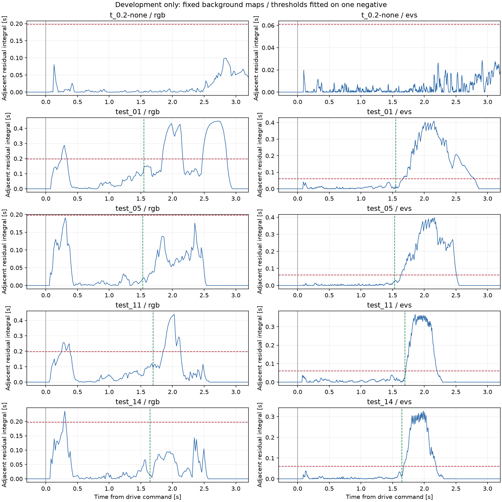
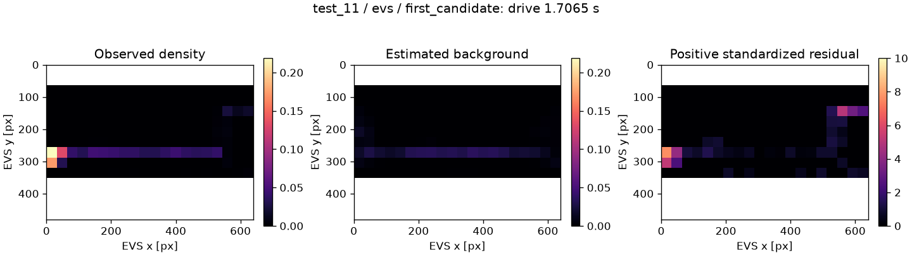
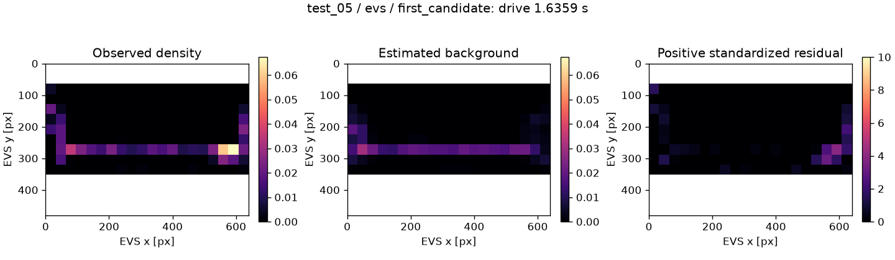

# grid活動分布の背景モデル：実装と調整用結果

2026-10-06。移動自車の背景活動を扱うため、32×32画素の活動マップから背景パターンを推定する方式を実装し、受領済みタイル配列で実行した。

## 結論

**EVSには、今回の調整用データ上で背景候補を抑えつつ、出現後の局所候補を残せる余地がある。**
負例最大スコアの2倍を閾値とする追加試行では、飛び出しなし1記録が0候補、飛び出し4記録が各1候補となった。
4件ともRGB初出現より後で、出現前の別候補はなかった。
RGBは同じ処理・同じ閾値設定手順でも早期候補と未検知が残った。

これは調整用の結果であり、対象を識別した成功率やEVSの一般的な優位性ではない。
負例は背景モデルと閾値の作成にも使用しているため、0件は独立した誤警報評価ではない。
閾値倍率2は初回の正例結果を確認した後に選んだ。評価用10件・静止記録は開いていない。

## 実装

- 本体：`tools/rc_popout_grid_background.py`
- 実行・保存・可視化：`tools/analyze_rc_popout_grid_background.py`
- 実行入口：`scripts/experiments/analyze_rc_popout_grid_background.sh`
- 入力：既存の `rgb_tiles.npz` / `evs_tiles.npz`。ROS・RAW再読取は不要。
- ニューラルネットワークは使用しない。ただし負例への統計モデルの適合を行うので、学習を一切しない方式とは説明しない。

### 背景パターンの作成

背景モデルの入力は調整用負例 `t_0.2-none` のみ。
観測済みの `pre_drive`（発進前1秒）と `drive`（約2秒）の区間を分離して使う。
これは指令区間であり、実速度で確認した静止・走行の区分ではない。
各区間内の20 msごとのビンから、観測窓全体が区間内に収まる最後のサンプルを1個選ぶ。
LED作業や待ち時間が長いほど背景統計で大きな重みを持つことを避ける。
実際の選択数はRGBが発進前48・走行100、EVSが50・101サンプルだった。

各タイルの有効画素数を A、活動数を n とし、特徴は `sqrt(n / A)`。
RGBの n は変化画素数、EVSの n は過去2 msのイベント数である。
全タイルの特徴ベクトルを、区間ごとの平均マップと最大3個の主成分（PCA）で表す。
タイル位置を捨てたヒストグラムではなく、どのタイルが一緒に増減するかを表すモデル。
活動総量で除算しないので、活動がほぼない時の比率の不安定さも避ける。

### 逐次判定

1. 現在の活動マップを2種類の背景モデルへ投影する。係数は負例での標準偏差の±3倍に制限し、推定特徴の負値は0にする。
2. 全タイルの二乗誤差が小さい方を採用する。現在の発進時刻・方向・初出現注釈でモデルを選ばない。
3. 観測から推定背景を引き、背景作成区間の絶対残差95%点で割る。尺度の下限は1イベント／変化画素相当とし、正の残差を0～10に制限する。
4. タイル別に `dC/dt = (z - 1) - C / 0.05` を積分し、負値は0にする。
5. 横または縦に隣接する2タイルの小さい方をペアスコアとし、全ペアの最大値で候補を出す。終了閾値は開始閾値の半分。

RGB・EVSで処理構造・rank・時間定数・係数制限・閾値倍率は共通。
モデル・残差尺度・最終閾値は各センサの負例から同じ手順で求める。
RGBは元のフレーム対、EVSは2 ms窓を1 ms刻みで処理し、RGBフレームを複製して判定回数を増やさない。
入力窓・観測間隔の欠測とinterval境界で積分と警報をリセットする。候補時刻は判定が利用可能なサンプル終点。
初出現・phase情報を使うのは報告時と、負例の背景モデル作成時だけである。

## 実行と設定選択の経緯

1. rank=3、積分時定数50 ms、閾値倍率1.1を初期案として実装し、正例を計算した。
2. EVSは4正例中3件に早期候補が残ったが、出現後のスコアは早期反応より大きかった。
3. 結果を見た後、同じモデルのまま倍率1.5・2・3を両センサに適用した。
4. EVSでは3倍率とも各正例1候補・出現前0候補となった。倍率2を次の映像確認用に選んだ。

モデル・尺度を作るのは負例の指定2区間。閾値の元になる最大値は**負例の全保存区間**で求め、走行終了後の反応も含める。
正例を見て倍率を選んでいるため、調整用正例へのチューニングが入っている。
開始位置や出現タイミングに合わせた検知ゲート、シーン別・方向別閾値は使用していない。

| 閾値倍率 | RGB正例の候補総数 | RGB初出現−30 msより前 | EVS正例の候補総数 | EVS初出現−30 msより前 |
|---:|---:|---:|---:|---:|
| 1.1（初回） | 10 | 6 | 10 | 6 |
| 1.5 | 7 | 4 | 4 | 0 |
| 2（映像確認用） | 6 | 3 | 4 | 0 |
| 3 | 3 | 0 | 4 | 0 |

表は調整用正例4件の全保存区間。負例候補は全倍率・両センサで0件（閾値作成に使った記録への再適用）。
詳細：[threshold_sensitivity.csv](evidence/rc_popout_20260930/grid_background_20261006/threshold_sensitivity.csv)。

## 倍率2での結果

RGB：負例最大0.09882699 → 閾値0.19765397 s。
EVS：負例最大0.03045139 → 閾値0.06090279 s。
これらは積分スコアの単位であり、検知遅れそのものではない。

| 記録 | EVS候補数 | 候補−RGB初出現 | EVS開始タイルID | RGB候補数 | RGBの最初の候補−RGB初出現 |
|---|---:|---:|---|---:|---:|
| `t_0.2-none` | 0 | — | — | 0 | — |
| `test_01`・20%左 | 1 | +114.7 ms | 160, 180 | 3 | −1290.9 ms |
| `test_05`・20%右 | 1 | +105.1 ms | 177, 178 | 0 | — |
| `test_11`・100%左 | 1 | +13.0 ms | 160, 180 | 2 | −1441.7 ms |
| `test_14`・100%右 | 1 | +30.5 ms | 177, 197 | 1 | −1362.8 ms |

20%・100%はプロポ設定。EVSの4候補は全保存区間で最初かつ唯一の候補であり、初出現に近い候補を後から選んだ値ではない。
表の差はRGB手動初出現との比較であり、RGB検知器・人間との反応時間差や処理遅延ではない。
同期残差・RGB約60 Hzの注釈分解能があるため、特に13 msなどの値からセンサのms単位の優劣を断定しない。

全出力：[summary.csv](evidence/rc_popout_20260930/grid_background_20261006/summary.csv)、
[candidates.csv](evidence/rc_popout_20260930/grid_background_20261006/candidates.csv)。



緑破線はRGB初出現、赤破線は候補閾値。可視化だけ発進付近へ拡大し、計算・候補集計は全保存区間で行った。

### 分布として何が残ったか

以下はEVS候補時点のタイル値。左が観測、中央が推定背景、右が標準化した正の残差。
画素単位のセグメンテーションではなく、ROIと交差する各タイル内の集計を描いている。





これらでは横方向に広がる活動の一部が背景側に入り、左／右側の局所残差が残っている。
方向ラベルは判定に使っていない。対象との重なりは次の枠付き動画で確認する。
従来の候補動画と時刻・タイルが異なるため、以前の画像確認をそのまま今回の検知成功の確認には置き換えない。

背景参照最大（負例全体と正例初出現−30 msより前）と、4正例の出現後250 ms以内のピークの最小値も集計した。
EVSでは0.0415732と0.1920113（比4.62）、RGBでは0.2886608と0.0853211（比0.296）。
このスコアではRGBの全背景超過を抑えながら4件全てを250 ms以内に拾う単一閾値はない。
これは注釈を使った事後診断であり、モデルや検知の入力ではない。全手法の不可能性を示す値でもない。

## 再現コマンド

Linux側に変更を反映して実行する。既存のタイルを再利用し、現在の注釈・同期のハッシュ整合も確認する。

```bash
cd /workspaces

bash scripts/experiments/analyze_rc_popout_grid_background.sh \
  --tile-dir /workspaces/record/09-30/analysis/tile_dev_trial01 \
  --subset development \
  --threshold-margin 2 \
  --probe-margins 1.1 1.5 2 3 \
  --output /workspaces/record/09-30/analysis/grid_background_dev_trial01 \
  --plots
```

必要な追加ライブラリはNumPyと、`--plots` 使用時のMatplotlib。出力先が既存なら停止する。
受領時のアーカイブを厳密に再現する場合は `--tile-dir ...` を
`--bundle /workspaces/record/09-30/analysis/development_debug_bundle01.zip` へ置き換える。
アーカイブ経由では現在のRAW・同期・注釈を再検査したことにはならない。

出力はモデルJSON、設定・ハッシュ、全時刻のスコアCSV、背景・残差・積分状態NPZ、全候補、閾値感度表、図、`index.html`。
`candidate_review_manifest.json` は各正例のEVS候補が1件ずつの時だけ出力する。
複数候補から注釈に近い1件を自動選択することはない。

既存の共通視野動画で新しい候補位置を確認する：

```bash
cd /workspaces

bash scripts/experiments/render_rc_popout_candidate_reviews.sh \
  --record-root /workspaces/record/09-30/dynamic \
  --manifest /workspaces/record/09-30/analysis/grid_background_dev_trial01/candidate_review_manifest.json \
  --output /workspaces/record/09-30/analysis/grid_background_candidate_review_trial01
```

同期・注釈・校正・RGBタイムラインと対象区間の整合検査は既存の動画レビュー処理が行う。
表示のイベント窓は元動画の中心10 ms窓の場合があり、検知の過去2 ms窓と同じではない。
この動画は対象位置の定性的確認であり、全イベントの寄与やセンサの処理遅延を測るものではない。

## 検証範囲と保存物

- 手元の `development_debug_bundle01.zip` を検証し、5記録×2センサで実行済み。
- 最終保存先：`record/09-30/analysis/grid_background_dev_20261006/`。
- [入力・結果の証跡](evidence/rc_popout_20260930/grid_background_20261006/provenance.json)、[実行設定と入力ハッシュ](evidence/rc_popout_20260930/grid_background_20261006/run_config.json)。
- 合成データ・既存処理との連携で33テスト通過。背景再構成、局所ペア、未来非依存、欠測リセット、正例を変えても背景モデル・数値閾値が変わらないこと、動画レビュー形式との連携を確認。
- PNGの目視確認、保存コード・モデルSHA-256の一致を確認。
- Linux上の新コマンド、今回の候補の実動画、評価用・静止記録、オンライン実時間動作は未検証。

倍率選択には正例を見た人の判断が入る。一方、同じ倍率を与えた計算の中では、正例の内容や初出現注釈から背景モデル・閾値の数値を自動調整しない。この2点を区別する。

## ポスターに示す場合

現時点では「自車移動による背景活動に対して、grid分布の背景モデルを試作し、調整用4例で出現後の局所候補を得た」とする。
RGBの課題、負例の再使用、調整後の結果であることを併記する。
まだ「移動条件でもEVSの優位性を実証」「未知データで4/4検知」「人間より早い」とは記載しない。

次は今回の候補の映像照合。その後に方式と設定を固定して内部評価用へ進み、最後に静止記録へ再調整せず適用する。
このCLIは調整用のみを受け付け、評価用を調整の延長で開かない構成にしている。
