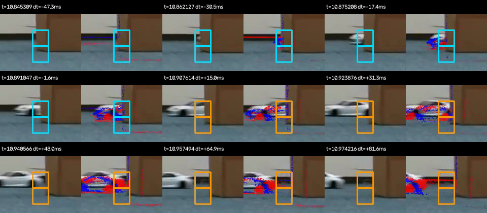

# grid背景モデルの候補映像照合

2026-10-06。受領した `grid_background_candidate_review_trial01` の4記録を、今回のgrid背景モデルの候補時刻・タイルと照合した。従来の局所変化検知のレビューとは別の結果である。

## 結論

**調整用の `test_01`・`test_05`・`test_11` では、候補付近の局所イベントとRCカーの出現位置が対応している。** `test_14` も車体の一部と重なるが、段ボールの縁・床境界が同じタイルに入るため、反応源の判定は保留する。

これは目視による空間的な対応の確認であり、「4/4検知成功」の確定ではない。4件とも背景が完全に消えたわけではなく、床模様や壁・床境界のイベントが映像に残る。候補を選ぶ残差スコアと、描画されている全イベントを区別する。

現方式をさらにこの4件へ合わせ込むより、設定を固定して内部評価用10件で確認する価値がある。判定保留の `test_14` も除外せず記録し、評価時にも同じ判定基準を使う。

## 時刻と目視所見

| 記録 | 候補時刻（記録基準秒） | 候補−RGB初出現 | 最初の橙色表示−候補 | 開始タイル | 所見 |
|---|---:|---:|---:|---|---|
| `test_01`・20%左 | 14.763993 | +114.7 ms | +9.27 ms | 160, 180 | 左画像端から入る車体とイベント輪郭が候補タイルに重なる。車両への反応を支持する。 |
| `test_05`・20%右 | 12.877008 | +105.1 ms | +12.22 ms | 177, 178 | 段ボール左側へ現れる車体・輪郭が横隣接2タイルに重なる。車両への反応を支持する。 |
| `test_11`・100%左 | 17.896067 | +13.0 ms | +4.56 ms | 160, 180 | 左端で現れる車体とイベント輪郭が重なる。壁・床境界も通るため純粋な車体成分だけとは断定しない。 |
| `test_14`・100%右 | 10.892609 | +30.5 ms | +15.01 ms | 177, 197 | 上側タイルは車体の一部と重なり、下側は床・段ボール下端に近い。車両由来と背景由来の寄与分離は保留。 |

20%・100%はプロポの設定値で、実測速度ではない。左出現の2件では候補時に左の遮蔽物が画面外にあり、画像端からの出現を確認している。物理的な遮蔽解除時刻と画像内の初出現時刻を同一視しない。

差分の基準は手動注釈したRGB初出現であり、RGB検知器や人間との反応時間差ではない。約60 HzのRGB注釈分解能と同期残差があるため、特に +13.0 ms を高精度な物理的遅延と説明しない。

## `test_14` の表示時刻と検知窓

候補直前の表示フレームは `10.891047 s`（候補より1.56 ms前）、最初の橙色は `10.907614 s`（15.01 ms後）。この間にRCカーが左へ移動する。固定枠は追跡枠ではなく、色も候補前後を表すだけで、警報の継続状態ではない。

各小区画の左はRGB、右はRGB＋EVS。元MP4の連続9フレームから同じ座標を等倍で切り出した。`dt` は候補時刻との差である。検知対象の空間範囲を変えたものではない。

保存済みの過去2 msタイル入力と積分状態も確認した。

| 候補からの時刻 | tile 177イベント数 | tile 197イベント数 | tile 177積分値 | tile 197積分値 |
|---:|---:|---:|---:|---:|
| −100 ms | 2 | 4 | 0.000000 | 0.000000 |
| −30 ms | 120 | 13 | 0.021170 | 0.012597 |
| −15 ms | 60 | 28 | 0.051525 | 0.033142 |
| 0 ms | 143 | 62 | 0.085769 | 0.061085 |
| +15 ms | 54 | 2 | 0.105851 | 0.071044 |

開始閾値は0.06090279。候補時刻では両タイルの積分値が閾値を超えている。約15 ms後に下側のイベントが少なく見えても、過去の反応を積分する判定と矛盾しない。この数値確認だけではイベントの物体由来までは分からない。

映像のイベント表示は**中心10 ms窓**、検知は**過去2 ms窓と時定数50 msの積分**。映像の点をそのまま検知入力・寄与に読み替えない。RGBとEVSの輪郭にも位置差があり、回転のみの空間変換では近距離物体の視差などが残り得る。今回の映像から原因を時間同期だけに帰属せず、同期・ROI・閾値を変更していない。

## ファイル・対応関係の検証

受領元：`/Users/at/Downloads/scp/grid_background_candidate_review_trial01/`。
Linux出力元：`/workspaces/record/09-30/analysis/grid_background_candidate_review_trial01/`。

- 全36ファイルのサイズ・SHA-256を保存。受領manifestは既存の今回用manifestと完全一致。
- 描画コード・検知設定・split・校正のハッシュと、各記録の注釈・同期ハッシュの対応を確認。
- 4本とも1280×608、36フレームを最後までデコード。約14.92 fps、4倍スロー。合計144フレーム。
- `frames.csv` の連続フレーム番号、単調な記録時刻、候補・初出現との差、summaryの前後フレームを検査。候補前後PNGと同位置のMP4フレームにも大きな差がないことを確認。
- 4件の候補時刻・開始タイルを保存済みEVS解析NPZとも照合。NPZの `winner_pair` は列番号なので `tile_id` を介して照合した。
- 3本では元の全長プレビューの末尾未生成が記録されているが、受領した候補付近36フレームは元の生成済み範囲内。切り出し区間の欠落は見つからなかった。

実施した目視はcontact sheet、候補前後のPNG、および `test_14` の連続9フレーム。全144フレームのデコード検査を、全画面の連続再生による目視検査とは区別する。リモートのRAW・元の全長MP4・現在の同期ファイルを再取得して検査したわけではない。

[検証結果・受領ファイルハッシュ](evidence/rc_popout_20260930/grid_background_20261006/visual_review/verification.json)。検知の実装・設定選択・再現コマンドは[解析記録](rc_popout_grid_background_20261006.md)を参照。

## 次の評価

1. 現在の背景モデル・閾値倍率2・ROI・コード・splitの固定と、評価時に再適合しない実行経路の追加は完了した。[内部評価手順](rc_popout_grid_background_evaluation_20261006.md)のコマンドをデータ側で実行する。評価用実データの実行は未実施。
2. 固定済み区分の内部評価用10件（飛び出しなし2件、あり8件）を全保存区間で処理する。候補数・出現前の候補・候補と対象の対応・未検知・初出現との差を報告し、RGBの早期候補や未検知も同じ基準で残す。
3. その結果を見て調整し直す場合は探索結果として分け、同じデータを独立な評価結果とは呼ばない。静止記録への適用はモデル・閾値を変えず別条件への適用として示す。

負例1件の0候補は、その負例で背景モデルと閾値を作った結果であり、独立した誤警報評価ではない。内部評価用記録も以前の別解析で集計結果を見ているため、完全に未知のデータとは扱わない。

ポスターには現時点で「移動背景を含む調整用4例で出現後に局所候補を得た。うち3例で車体位置との対応を確認し、1例は遮蔽物境界の寄与が残る」と記載できる。背景分離の完了、EVSの一般的優位性、人間との比較はまだ主張しない。
