# JetPilot topic graph

この文書は各 `jetpilot_*` package の `README.md` にある `Inputs / Outputs` 表から生成されています。手動で編集しないでください。

図は全機能を重ねた静的なsupersetです。同じtopicを使う排他的なlaunch構成も同時に表示されます。実行時のnamespace、任意remap、外部package内部のinterfaceは反映されません。

## System graph

```mermaid
flowchart LR
  classDef topic fill:#fff4cc,stroke:#9a7600,color:#222;
  classDef node fill:#e8f1ff,stroke:#3167a8,color:#111;
  node_0a689e395b["jetpilot_bag_tools<br/>bag_manager_node"]:::node
  node_2ecb2d3885["jetpilot_bridge_interface<br/>jetpilot_bridge_interface_node"]:::node
  node_a8fba005a8["jetpilot_control<br/>autonomous_control_node"]:::node
  node_598c27ec1b["jetpilot_controller<br/>path_tracking_controller_node"]:::node
  node_3337f59264["jetpilot_e2e_inference<br/>e2e_control_decoder"]:::node
  node_d237e5aa5a["jetpilot_e2e_inference<br/>e2e_image_encoder"]:::node
  node_d3186fd9b7["jetpilot_e2e_inference<br/>e2e_pytorch_inference"]:::node
  node_40b140ce82["jetpilot_e2e_inference<br/>e2e_tensor_rt"]:::node
  node_3ae38c0193["jetpilot_e2e_inference<br/>e2e_trajectory_decoder"]:::node
  node_8231c087c2["jetpilot_hdmap_publisher<br/>hd_map_publisher_node"]:::node
  node_3a9d799d0b["jetpilot_hdmap_publisher<br/>hd_map_section_localizer_node"]:::node
  node_5e63a0d218["jetpilot_localization_manager<br/>jetpilot_localization_manager_node"]:::node
  node_ba94d8424c["jetpilot_object_detection<br/>object_detection_image_encoder"]:::node
  node_10e1fc24f1["jetpilot_object_detection<br/>object_detection_image_gate"]:::node
  node_f70bbb8908["jetpilot_object_detection<br/>object_detection_tensor_rt"]:::node
  node_c67a172c25["jetpilot_object_detection<br/>yolov8_decoder"]:::node
  node_31238c18b9["jetpilot_operation<br/>command_mux_node"]:::node
  node_e485b2aa6a["jetpilot_operation<br/>operation_mode_manager_node"]:::node
  node_2850439967["jetpilot_planning<br/>competition_route_lane_selector_node"]:::node
  node_500d9a5bb3["jetpilot_planning<br/>custom_line_path_publisher"]:::node
  node_83bc24ce6d["jetpilot_planning<br/>raceline_path_publisher"]:::node
  node_d267d0e142["jetpilot_planning<br/>route_lane_selector_node"]:::node
  node_7d2dbc11e4["jetpilot_planning_manager<br/>planning_manager_node"]:::node
  node_3a23e8c7d2["jetpilot_recovery_planner<br/>breadcrumb_recovery_planner_node"]:::node
  node_c6f7c015c9["jetpilot_rtp_tools<br/>image_rtp_sender"]:::node
  node_ae38a1cbe2["jetpilot_signal_detection<br/>signal_detection_node"]:::node
  node_61bbe04072["jetpilot_teleop_tools<br/>teleop_button_manager_node"]:::node
  node_a75dedcb40["jetpilot_teleop_tools<br/>teleop_cmd_node"]:::node
  node_ee34b588e6["jetpilot_vesc_interface<br/>control_cmd_to_vesc_node"]:::node
  topic_d419a15656(["/auto/control_cmd"]):::topic
  topic_d426319e13(["/bag/request"]):::topic
  topic_e9fffbccea(["/bag/status"]):::topic
  topic_18083ad082(["/commands/motor/brake"]):::topic
  topic_e7e37fd0d7(["/commands/motor/speed"]):::topic
  topic_15c100e16c(["/commands/servo/position"]):::topic
  topic_424ac85d4d(["/controller/diagnostics"]):::topic
  topic_c588466f9a(["/controller/lookahead_point"]):::topic
  topic_b67abfc3f0(["/controller/ready"]):::topic
  topic_1407f9295b(["/controller/tracking_markers"]):::topic
  topic_1b1d26a39a(["/diagnostics"]):::topic
  topic_b55e582928(["/e2e/diagnostics"]):::topic
  topic_8e91302606(["/e2e/tensor_input"]):::topic
  topic_bb7bc9426d(["/e2e/tensor_output"]):::topic
  topic_93cb8db982(["/event_camera/raw_recording/request"]):::topic
  topic_64aa81c0e0(["/hd_map/junctions"]):::topic
  topic_761a7dc9a8(["/hd_map/lane_markers"]):::topic
  topic_013fdfa050(["/hd_map/primary_centerline_path"]):::topic
  topic_54a1781b7e(["/hd_map/section_markers"]):::topic
  topic_a1583b93e8(["/initialpose"]):::topic
  topic_cd6e9ebcf5(["/joy"]):::topic
  topic_acda96a26b(["/localization/current_section"]):::topic
  topic_71bb3b3403(["/localization/current_section_marker"]):::topic
  topic_fee40b6769(["/localization/pose_hint"]):::topic
  topic_d65e861d11(["/localization/pose_hint_required"]):::topic
  topic_8f71c9b828(["/localization/pose_hint_state"]):::topic
  topic_6d56d3a00b(["/localization/trigger"]):::topic
  topic_34bac883a1(["/localization/vslam/diagnostics"]):::topic
  topic_ec6961d166(["/operation_mode/request"]):::topic
  topic_a0f0ff96b8(["/operation_mode/state"]):::topic
  topic_1f904e36c9(["/perception/detections"]):::topic
  topic_8c6543ba3a(["/perception/direction_signal"]):::topic
  topic_f45e4390ec(["/perception/object_detection/camera_info"]):::topic
  topic_c534471f48(["/perception/object_detection/diagnostics"]):::topic
  topic_55cc48e4f0(["/perception/object_detection/image"]):::topic
  topic_3f6079f557(["/perception/object_detection/tensor_input"]):::topic
  topic_1e497b9842(["/perception/object_detection/tensor_output"]):::topic
  topic_dba0cc7505(["/perception/opponent/odometry"]):::topic
  topic_c908bb83eb(["/perception/signal/detections"]):::topic
  topic_1121b3d063(["/planning/custom_path"]):::topic
  topic_4f0ac8fc3b(["/planning/custom_trajectory"]):::topic
  topic_90145a3d79(["/planning/diagnostics"]):::topic
  topic_8721d1a80a(["/planning/manager/status"]):::topic
  topic_ea2f6d6f66(["/planning/raceline_path"]):::topic
  topic_5ba195eec3(["/planning/raceline_trajectory"]):::topic
  topic_7542e5eef4(["/planning/ready"]):::topic
  topic_49aa4d98a9(["/planning/recovery/ready"]):::topic
  topic_3ff86903c4(["/planning/recovery/request"]):::topic
  topic_dd1f34788b(["/planning/recovery/status"]):::topic
  topic_2825a5eeb5(["/planning/recovery/trajectory_profile"]):::topic
  topic_3e6e6c80ce(["/planning/requested_lane"]):::topic
  topic_e0dbd31f04(["/planning/route/diagnostics"]):::topic
  topic_0dd78f430a(["/planning/route/ready"]):::topic
  topic_c05e57cf8b(["/planning/route/selected_lane"]):::topic
  topic_9112ebf22c(["/planning/route/target_speed"]):::topic
  topic_5a536e58fd(["/planning/route/trajectory"]):::topic
  topic_336d4d14cd(["/planning/route/trajectory_profile"]):::topic
  topic_908526185d(["/planning/selected_lane"]):::topic
  topic_09109548a1(["/planning/target_speed"]):::topic
  topic_14954a00de(["/planning/trajectory"]):::topic
  topic_6d5f1c0267(["/planning/trajectory_profile"]):::topic
  topic_c9f4500acc(["/propo/control_cmd"]):::topic
  topic_b2c11ee38f(["/realsense/color/camera_info"]):::topic
  topic_a26dab8f0e(["/realsense/color/image_raw"]):::topic
  topic_b73c2adb44(["/safety/collision_detected"]):::topic
  topic_9bcf1924dd(["/speed_offset_dec"]):::topic
  topic_c2c16a9a15(["/speed_offset_inc"]):::topic
  topic_ff5c222eb8(["/steer_offset_dec"]):::topic
  topic_fb0262a8df(["/steer_offset_inc"]):::topic
  topic_51b27839b3(["/teleop/control_cmd"]):::topic
  topic_09da5c7d24(["/vehicle/control_cmd"]):::topic
  topic_7e12a6f744(["/visual_localization/pose"]):::topic
  topic_c2f419e2fe(["/visual_slam/tracking/odometry"]):::topic
  topic_7c79fa2b88(["/visual_slam/trigger_hint"]):::topic
  topic_d426319e13 --> node_0a689e395b
  topic_a0f0ff96b8 --> node_2ecb2d3885
  topic_ff5c222eb8 --> node_2ecb2d3885
  topic_fb0262a8df --> node_2ecb2d3885
  topic_09da5c7d24 --> node_2ecb2d3885
  topic_8f71c9b828 --> node_598c27ec1b
  topic_dba0cc7505 --> node_598c27ec1b
  topic_8721d1a80a --> node_598c27ec1b
  topic_7542e5eef4 --> node_598c27ec1b
  topic_09109548a1 --> node_598c27ec1b
  topic_14954a00de --> node_598c27ec1b
  topic_6d5f1c0267 --> node_598c27ec1b
  topic_c2f419e2fe --> node_598c27ec1b
  topic_bb7bc9426d --> node_3337f59264
  topic_b2c11ee38f --> node_d237e5aa5a
  topic_a26dab8f0e --> node_d237e5aa5a
  topic_a26dab8f0e --> node_d3186fd9b7
  topic_8e91302606 --> node_40b140ce82
  topic_bb7bc9426d --> node_3ae38c0193
  topic_a1583b93e8 --> node_5e63a0d218
  topic_6d56d3a00b --> node_5e63a0d218
  topic_34bac883a1 --> node_5e63a0d218
  topic_7e12a6f744 --> node_5e63a0d218
  topic_7c79fa2b88 --> node_5e63a0d218
  topic_f45e4390ec --> node_ba94d8424c
  topic_55cc48e4f0 --> node_ba94d8424c
  topic_b2c11ee38f --> node_10e1fc24f1
  topic_a26dab8f0e --> node_10e1fc24f1
  topic_3f6079f557 --> node_f70bbb8908
  topic_1e497b9842 --> node_c67a172c25
  topic_d419a15656 --> node_31238c18b9
  topic_a0f0ff96b8 --> node_31238c18b9
  topic_c9f4500acc --> node_31238c18b9
  topic_51b27839b3 --> node_31238c18b9
  topic_ec6961d166 --> node_e485b2aa6a
  topic_013fdfa050 --> node_2850439967
  topic_acda96a26b --> node_2850439967
  topic_3e6e6c80ce --> node_2850439967
  topic_013fdfa050 --> node_d267d0e142
  topic_acda96a26b --> node_d267d0e142
  topic_4f0ac8fc3b --> node_d267d0e142
  topic_5ba195eec3 --> node_d267d0e142
  topic_3e6e6c80ce --> node_d267d0e142
  topic_64aa81c0e0 --> node_7d2dbc11e4
  topic_acda96a26b --> node_7d2dbc11e4
  topic_8c6543ba3a --> node_7d2dbc11e4
  topic_49aa4d98a9 --> node_7d2dbc11e4
  topic_dd1f34788b --> node_7d2dbc11e4
  topic_2825a5eeb5 --> node_7d2dbc11e4
  topic_e0dbd31f04 --> node_7d2dbc11e4
  topic_5a536e58fd --> node_7d2dbc11e4
  topic_336d4d14cd --> node_7d2dbc11e4
  topic_b73c2adb44 --> node_7d2dbc11e4
  topic_3ff86903c4 --> node_3a23e8c7d2
  topic_c2f419e2fe --> node_3a23e8c7d2
  topic_a26dab8f0e --> node_c6f7c015c9
  topic_64aa81c0e0 --> node_ae38a1cbe2
  topic_acda96a26b --> node_ae38a1cbe2
  topic_c908bb83eb --> node_ae38a1cbe2
  topic_cd6e9ebcf5 --> node_61bbe04072
  topic_cd6e9ebcf5 --> node_a75dedcb40
  topic_9bcf1924dd --> node_a75dedcb40
  topic_c2c16a9a15 --> node_a75dedcb40
  topic_09da5c7d24 --> node_ee34b588e6
  node_0a689e395b --> topic_e9fffbccea
  node_0a689e395b --> topic_93cb8db982
  node_2ecb2d3885 --> topic_1b1d26a39a
  node_2ecb2d3885 --> topic_ec6961d166
  node_a8fba005a8 --> topic_d419a15656
  node_598c27ec1b --> topic_d419a15656
  node_598c27ec1b --> topic_424ac85d4d
  node_598c27ec1b --> topic_c588466f9a
  node_598c27ec1b --> topic_b67abfc3f0
  node_598c27ec1b --> topic_1407f9295b
  node_3337f59264 --> topic_d419a15656
  node_3337f59264 --> topic_b55e582928
  node_d237e5aa5a --> topic_8e91302606
  node_d3186fd9b7 --> topic_d419a15656
  node_40b140ce82 --> topic_bb7bc9426d
  node_3ae38c0193 --> topic_7542e5eef4
  node_3ae38c0193 --> topic_09109548a1
  node_3ae38c0193 --> topic_14954a00de
  node_8231c087c2 --> topic_64aa81c0e0
  node_8231c087c2 --> topic_761a7dc9a8
  node_8231c087c2 --> topic_013fdfa050
  node_8231c087c2 --> topic_54a1781b7e
  node_3a9d799d0b --> topic_acda96a26b
  node_3a9d799d0b --> topic_71bb3b3403
  node_5e63a0d218 --> topic_fee40b6769
  node_5e63a0d218 --> topic_d65e861d11
  node_5e63a0d218 --> topic_8f71c9b828
  node_ba94d8424c --> topic_3f6079f557
  node_10e1fc24f1 --> topic_f45e4390ec
  node_10e1fc24f1 --> topic_55cc48e4f0
  node_f70bbb8908 --> topic_1e497b9842
  node_c67a172c25 --> topic_1f904e36c9
  node_c67a172c25 --> topic_c534471f48
  node_31238c18b9 --> topic_09da5c7d24
  node_e485b2aa6a --> topic_a0f0ff96b8
  node_2850439967 --> topic_e0dbd31f04
  node_2850439967 --> topic_0dd78f430a
  node_2850439967 --> topic_c05e57cf8b
  node_2850439967 --> topic_9112ebf22c
  node_2850439967 --> topic_5a536e58fd
  node_2850439967 --> topic_336d4d14cd
  node_500d9a5bb3 --> topic_1121b3d063
  node_500d9a5bb3 --> topic_4f0ac8fc3b
  node_83bc24ce6d --> topic_ea2f6d6f66
  node_83bc24ce6d --> topic_5ba195eec3
  node_d267d0e142 --> topic_90145a3d79
  node_d267d0e142 --> topic_7542e5eef4
  node_d267d0e142 --> topic_908526185d
  node_d267d0e142 --> topic_09109548a1
  node_d267d0e142 --> topic_14954a00de
  node_d267d0e142 --> topic_6d5f1c0267
  node_7d2dbc11e4 --> topic_8721d1a80a
  node_7d2dbc11e4 --> topic_7542e5eef4
  node_7d2dbc11e4 --> topic_3ff86903c4
  node_7d2dbc11e4 --> topic_3e6e6c80ce
  node_7d2dbc11e4 --> topic_09109548a1
  node_7d2dbc11e4 --> topic_14954a00de
  node_7d2dbc11e4 --> topic_6d5f1c0267
  node_3a23e8c7d2 --> topic_49aa4d98a9
  node_3a23e8c7d2 --> topic_dd1f34788b
  node_3a23e8c7d2 --> topic_2825a5eeb5
  node_ae38a1cbe2 --> topic_8c6543ba3a
  node_61bbe04072 --> topic_d426319e13
  node_61bbe04072 --> topic_6d56d3a00b
  node_61bbe04072 --> topic_ec6961d166
  node_61bbe04072 --> topic_c2c16a9a15
  node_61bbe04072 --> topic_ff5c222eb8
  node_61bbe04072 --> topic_fb0262a8df
  node_a75dedcb40 --> topic_51b27839b3
  node_ee34b588e6 --> topic_18083ad082
  node_ee34b588e6 --> topic_e7e37fd0d7
  node_ee34b588e6 --> topic_15c100e16c
```

## Topic inventory

| Topic | Type | Publishers | Subscribers |
| --- | --- | --- | --- |
| `/auto/control_cmd` | `jetpilot_msgs/msg/ControlCommand` | `jetpilot_control/autonomous_control_node`, `jetpilot_controller/path_tracking_controller_node`, `jetpilot_e2e_inference/e2e_control_decoder`, `jetpilot_e2e_inference/e2e_pytorch_inference` | `jetpilot_operation/command_mux_node` |
| `/bag/request` | `jetpilot_msgs/msg/BagRequest` | `jetpilot_teleop_tools/teleop_button_manager_node` | `jetpilot_bag_tools/bag_manager_node` |
| `/bag/status` | `jetpilot_msgs/msg/BagStatus` | `jetpilot_bag_tools/bag_manager_node` | 外部 |
| `/commands/motor/brake` | `std_msgs/msg/Float64` | `jetpilot_vesc_interface/control_cmd_to_vesc_node` | 外部 |
| `/commands/motor/speed` | `std_msgs/msg/Float64` | `jetpilot_vesc_interface/control_cmd_to_vesc_node` | 外部 |
| `/commands/servo/position` | `std_msgs/msg/Float64` | `jetpilot_vesc_interface/control_cmd_to_vesc_node` | 外部 |
| `/controller/diagnostics` | `diagnostic_msgs/msg/DiagnosticArray` | `jetpilot_controller/path_tracking_controller_node` | 外部 |
| `/controller/lookahead_point` | `geometry_msgs/msg/PoseStamped` | `jetpilot_controller/path_tracking_controller_node` | 外部 |
| `/controller/ready` | `std_msgs/msg/Bool` | `jetpilot_controller/path_tracking_controller_node` | 外部 |
| `/controller/tracking_markers` | `visualization_msgs/msg/MarkerArray` | `jetpilot_controller/path_tracking_controller_node` | 外部 |
| `/diagnostics` | `diagnostic_msgs/msg/DiagnosticArray` | `jetpilot_bridge_interface/jetpilot_bridge_interface_node` | 外部 |
| `/e2e/diagnostics` | `diagnostic_msgs/msg/DiagnosticArray` | `jetpilot_e2e_inference/e2e_control_decoder` | 外部 |
| `/e2e/tensor_input` | `isaac_ros_tensor_list_interfaces/msg/TensorList` | `jetpilot_e2e_inference/e2e_image_encoder` | `jetpilot_e2e_inference/e2e_tensor_rt` |
| `/e2e/tensor_output` | `isaac_ros_tensor_list_interfaces/msg/TensorList` | `jetpilot_e2e_inference/e2e_tensor_rt` | `jetpilot_e2e_inference/e2e_control_decoder`, `jetpilot_e2e_inference/e2e_trajectory_decoder` |
| `/event_camera/raw_recording/request` | `jetpilot_msgs/msg/BagRequest` | `jetpilot_bag_tools/bag_manager_node` | 外部 |
| `/hd_map/junctions` | `jetpilot_msgs/msg/JunctionArray` | `jetpilot_hdmap_publisher/hd_map_publisher_node` | `jetpilot_planning_manager/planning_manager_node`, `jetpilot_signal_detection/signal_detection_node` |
| `/hd_map/lane_markers` | `visualization_msgs/msg/MarkerArray` | `jetpilot_hdmap_publisher/hd_map_publisher_node` | 外部 |
| `/hd_map/primary_centerline_path` | `nav_msgs/msg/Path` | `jetpilot_hdmap_publisher/hd_map_publisher_node` | `jetpilot_planning/competition_route_lane_selector_node`, `jetpilot_planning/route_lane_selector_node` |
| `/hd_map/section_markers` | `visualization_msgs/msg/MarkerArray` | `jetpilot_hdmap_publisher/hd_map_publisher_node` | 外部 |
| `/initialpose` | `geometry_msgs/msg/PoseWithCovarianceStamped` | 外部 | `jetpilot_localization_manager/jetpilot_localization_manager_node` |
| `/joy` | `sensor_msgs/msg/Joy` | 外部 | `jetpilot_teleop_tools/teleop_button_manager_node`, `jetpilot_teleop_tools/teleop_cmd_node` |
| `/localization/current_section` | `std_msgs/msg/String` | `jetpilot_hdmap_publisher/hd_map_section_localizer_node` | `jetpilot_planning/competition_route_lane_selector_node`, `jetpilot_planning/route_lane_selector_node`, `jetpilot_planning_manager/planning_manager_node`, `jetpilot_signal_detection/signal_detection_node` |
| `/localization/current_section_marker` | `visualization_msgs/msg/Marker` | `jetpilot_hdmap_publisher/hd_map_section_localizer_node` | 外部 |
| `/localization/pose_hint` | `geometry_msgs/msg/PoseWithCovarianceStamped` | `jetpilot_localization_manager/jetpilot_localization_manager_node` | 外部 |
| `/localization/pose_hint_required` | `std_msgs/msg/Bool` | `jetpilot_localization_manager/jetpilot_localization_manager_node` | 外部 |
| `/localization/pose_hint_state` | `std_msgs/msg/String` | `jetpilot_localization_manager/jetpilot_localization_manager_node` | `jetpilot_controller/path_tracking_controller_node` |
| `/localization/trigger` | `std_msgs/msg/Bool` | `jetpilot_teleop_tools/teleop_button_manager_node` | `jetpilot_localization_manager/jetpilot_localization_manager_node` |
| `/localization/vslam/diagnostics` | `diagnostic_msgs/msg/DiagnosticArray` | 外部 | `jetpilot_localization_manager/jetpilot_localization_manager_node` |
| `/operation_mode/request` | `jetpilot_msgs/msg/OperationModeRequest` | `jetpilot_bridge_interface/jetpilot_bridge_interface_node`, `jetpilot_teleop_tools/teleop_button_manager_node` | `jetpilot_operation/operation_mode_manager_node` |
| `/operation_mode/state` | `jetpilot_msgs/msg/OperationModeState` | `jetpilot_operation/operation_mode_manager_node` | `jetpilot_bridge_interface/jetpilot_bridge_interface_node`, `jetpilot_operation/command_mux_node` |
| `/perception/detections` | `vision_msgs/msg/Detection2DArray` | `jetpilot_object_detection/yolov8_decoder` | 外部 |
| `/perception/direction_signal` | `jetpilot_msgs/msg/DirectionSignal` | `jetpilot_signal_detection/signal_detection_node` | `jetpilot_planning_manager/planning_manager_node` |
| `/perception/object_detection/camera_info` | `sensor_msgs/msg/CameraInfo` | `jetpilot_object_detection/object_detection_image_gate` | `jetpilot_object_detection/object_detection_image_encoder` |
| `/perception/object_detection/diagnostics` | `diagnostic_msgs/msg/DiagnosticArray` | `jetpilot_object_detection/yolov8_decoder` | 外部 |
| `/perception/object_detection/image` | `sensor_msgs/msg/Image` | `jetpilot_object_detection/object_detection_image_gate` | `jetpilot_object_detection/object_detection_image_encoder` |
| `/perception/object_detection/tensor_input` | `isaac_ros_tensor_list_interfaces/msg/TensorList` | `jetpilot_object_detection/object_detection_image_encoder` | `jetpilot_object_detection/object_detection_tensor_rt` |
| `/perception/object_detection/tensor_output` | `isaac_ros_tensor_list_interfaces/msg/TensorList` | `jetpilot_object_detection/object_detection_tensor_rt` | `jetpilot_object_detection/yolov8_decoder` |
| `/perception/opponent/odometry` | `nav_msgs/msg/Odometry` | 外部 | `jetpilot_controller/path_tracking_controller_node` |
| `/perception/signal/detections` | `vision_msgs/msg/Detection2DArray` | 外部 | `jetpilot_signal_detection/signal_detection_node` |
| `/planning/custom_path` | `nav_msgs/msg/Path` | `jetpilot_planning/custom_line_path_publisher` | 外部 |
| `/planning/custom_trajectory` | `jetpilot_msgs/msg/Trajectory` | `jetpilot_planning/custom_line_path_publisher` | `jetpilot_planning/route_lane_selector_node` |
| `/planning/diagnostics` | `diagnostic_msgs/msg/DiagnosticArray` | `jetpilot_planning/route_lane_selector_node` | 外部 |
| `/planning/manager/status` | `jetpilot_msgs/msg/PlanningManagerStatus` | `jetpilot_planning_manager/planning_manager_node` | `jetpilot_controller/path_tracking_controller_node` |
| `/planning/raceline_path` | `nav_msgs/msg/Path` | `jetpilot_planning/raceline_path_publisher` | 外部 |
| `/planning/raceline_trajectory` | `jetpilot_msgs/msg/Trajectory` | `jetpilot_planning/raceline_path_publisher` | `jetpilot_planning/route_lane_selector_node` |
| `/planning/ready` | `std_msgs/msg/Bool` | `jetpilot_e2e_inference/e2e_trajectory_decoder`, `jetpilot_planning/route_lane_selector_node`, `jetpilot_planning_manager/planning_manager_node` | `jetpilot_controller/path_tracking_controller_node` |
| `/planning/recovery/ready` | `std_msgs/msg/Bool` | `jetpilot_recovery_planner/breadcrumb_recovery_planner_node` | `jetpilot_planning_manager/planning_manager_node` |
| `/planning/recovery/request` | `std_msgs/msg/Bool` | `jetpilot_planning_manager/planning_manager_node` | `jetpilot_recovery_planner/breadcrumb_recovery_planner_node` |
| `/planning/recovery/status` | `jetpilot_msgs/msg/RecoveryStatus` | `jetpilot_recovery_planner/breadcrumb_recovery_planner_node` | `jetpilot_planning_manager/planning_manager_node` |
| `/planning/recovery/trajectory_profile` | `jetpilot_msgs/msg/Trajectory` | `jetpilot_recovery_planner/breadcrumb_recovery_planner_node` | `jetpilot_planning_manager/planning_manager_node` |
| `/planning/requested_lane` | `std_msgs/msg/String` | `jetpilot_planning_manager/planning_manager_node` | `jetpilot_planning/competition_route_lane_selector_node`, `jetpilot_planning/route_lane_selector_node` |
| `/planning/route/diagnostics` | `diagnostic_msgs/msg/DiagnosticArray` | `jetpilot_planning/competition_route_lane_selector_node` | `jetpilot_planning_manager/planning_manager_node` |
| `/planning/route/ready` | `std_msgs/msg/Bool` | `jetpilot_planning/competition_route_lane_selector_node` | 外部 |
| `/planning/route/selected_lane` | `std_msgs/msg/String` | `jetpilot_planning/competition_route_lane_selector_node` | 外部 |
| `/planning/route/target_speed` | `std_msgs/msg/Float32` | `jetpilot_planning/competition_route_lane_selector_node` | 外部 |
| `/planning/route/trajectory` | `nav_msgs/msg/Path` | `jetpilot_planning/competition_route_lane_selector_node` | `jetpilot_planning_manager/planning_manager_node` |
| `/planning/route/trajectory_profile` | `jetpilot_msgs/msg/Trajectory` | `jetpilot_planning/competition_route_lane_selector_node` | `jetpilot_planning_manager/planning_manager_node` |
| `/planning/selected_lane` | `std_msgs/msg/String` | `jetpilot_planning/route_lane_selector_node` | 外部 |
| `/planning/target_speed` | `std_msgs/msg/Float32` | `jetpilot_e2e_inference/e2e_trajectory_decoder`, `jetpilot_planning/route_lane_selector_node`, `jetpilot_planning_manager/planning_manager_node` | `jetpilot_controller/path_tracking_controller_node` |
| `/planning/trajectory` | `nav_msgs/msg/Path` | `jetpilot_e2e_inference/e2e_trajectory_decoder`, `jetpilot_planning/route_lane_selector_node`, `jetpilot_planning_manager/planning_manager_node` | `jetpilot_controller/path_tracking_controller_node` |
| `/planning/trajectory_profile` | `jetpilot_msgs/msg/Trajectory` | `jetpilot_planning/route_lane_selector_node`, `jetpilot_planning_manager/planning_manager_node` | `jetpilot_controller/path_tracking_controller_node` |
| `/propo/control_cmd` | `jetpilot_msgs/msg/ControlCommand` | 外部 | `jetpilot_operation/command_mux_node` |
| `/realsense/color/camera_info` | `sensor_msgs/msg/CameraInfo` | 外部 | `jetpilot_e2e_inference/e2e_image_encoder`, `jetpilot_object_detection/object_detection_image_gate` |
| `/realsense/color/image_raw` | `sensor_msgs/msg/Image` | 外部 | `jetpilot_e2e_inference/e2e_image_encoder`, `jetpilot_e2e_inference/e2e_pytorch_inference`, `jetpilot_object_detection/object_detection_image_gate`, `jetpilot_rtp_tools/image_rtp_sender` |
| `/safety/collision_detected` | `std_msgs/msg/Bool` | 外部 | `jetpilot_planning_manager/planning_manager_node` |
| `/speed_offset_dec` | `std_msgs/msg/Bool` | 外部 | `jetpilot_teleop_tools/teleop_cmd_node` |
| `/speed_offset_inc` | `std_msgs/msg/Bool` | `jetpilot_teleop_tools/teleop_button_manager_node` | `jetpilot_teleop_tools/teleop_cmd_node` |
| `/steer_offset_dec` | `std_msgs/msg/Bool` | `jetpilot_teleop_tools/teleop_button_manager_node` | `jetpilot_bridge_interface/jetpilot_bridge_interface_node` |
| `/steer_offset_inc` | `std_msgs/msg/Bool` | `jetpilot_teleop_tools/teleop_button_manager_node` | `jetpilot_bridge_interface/jetpilot_bridge_interface_node` |
| `/teleop/control_cmd` | `jetpilot_msgs/msg/ControlCommand` | `jetpilot_teleop_tools/teleop_cmd_node` | `jetpilot_operation/command_mux_node` |
| `/vehicle/control_cmd` | `jetpilot_msgs/msg/ControlCommand` | `jetpilot_operation/command_mux_node` | `jetpilot_bridge_interface/jetpilot_bridge_interface_node`, `jetpilot_vesc_interface/control_cmd_to_vesc_node` |
| `/visual_localization/pose` | `geometry_msgs/msg/PoseWithCovarianceStamped` | 外部 | `jetpilot_localization_manager/jetpilot_localization_manager_node` |
| `/visual_slam/tracking/odometry` | `nav_msgs/msg/Odometry` | 外部 | `jetpilot_controller/path_tracking_controller_node`, `jetpilot_recovery_planner/breadcrumb_recovery_planner_node` |
| `/visual_slam/trigger_hint` | `geometry_msgs/msg/PoseWithCovarianceStamped` | 外部 | `jetpilot_localization_manager/jetpilot_localization_manager_node` |

## Relative or configurable topic names

絶対名でないため、system graphでは自動結線していないinterfaceです。

| Direction | Package / Node | Name | Type |
| --- | --- | --- | --- |
| output | `jetpilot_bridge_interface/jetpilot_bridge_interface_node` | `~/active_path` | `std_msgs/msg/UInt8` |
| output | `jetpilot_bridge_interface/jetpilot_bridge_interface_node` | `~/output_channels` | `std_msgs/msg/Int32MultiArray` |
| output | `jetpilot_bridge_interface/jetpilot_bridge_interface_node` | `~/rc_channels` | `std_msgs/msg/Int32MultiArray` |
| output | `jetpilot_bridge_interface/jetpilot_bridge_interface_node` | `~/vbec_voltage` | `std_msgs/msg/Float32` |

## Source

- Packages: 18
- Topic endpoints: 140
- Generator: `scripts/generate_topic_graph.py`
- Contract: `docs/ros_package_readme_guideline.md`
